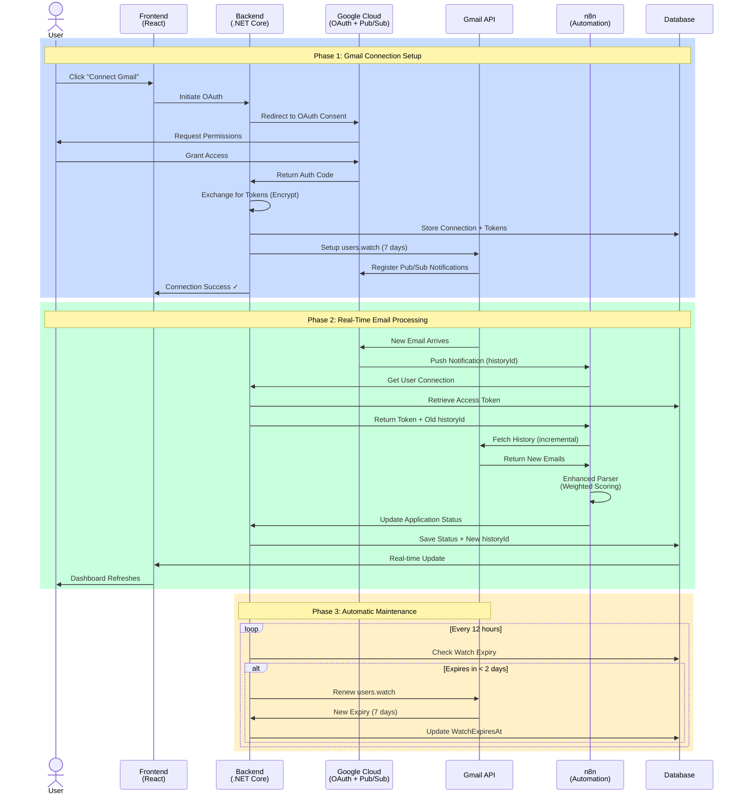

# Gmail Listener: Automated Job Application Tracking

---

## Introduction

### The Problem

Manual tracking of job application emails is time-consuming and error-prone. Users receive updates across multiple stages including interviews, assessments, offers, and rejections, but there's no centralized way to automatically update application status in real-time.

### Our Solution

We developed an automated email monitoring system that listens to Gmail for job-related updates. The system features an intelligent parser that extracts application status from email content and provides real-time synchronization with the application tracking dashboard.

### Evolution of Approaches

We implemented two approaches to solve this problem:

1. **Polling Approach (Phase 1)**: Periodic checks every 5 minutes
2. **Push Notifications (Phase 2)**: Real-time updates via Google Pub/Sub ✅ *Currently Active*


---

## Architecture & Complete Flow

### System Components

Our Gmail Listener integrates four major components to provide seamless automation:

**Frontend (React)**
- Gmail OAuth connection user interface
- "Connect Gmail" button for easy setup
- Real-time connection status display
- One-click disconnect option

**Backend (.NET Core)**
- OAuth 2.0 token management with encryption
- Gmail API watch setup and automatic renewal
- Email update processing endpoints
- Secure database persistence for connection details and historyId tracking

**Google Cloud Platform**
- OAuth consent screen configuration
- Pub/Sub topic creation (`gmail-notifications`)
- Pub/Sub subscription management
- Gmail API `users.watch` registration

**n8n Workflow Automation**
- Webhook endpoint to receive Pub/Sub notifications
- Gmail API integration for fetching new emails
- Enhanced email parser with weighted scoring system
- Backend API integration for status updates

### End-to-End Flow



### Key Technical Decisions

- **Security**: OAuth tokens are encrypted at rest using AES-256 encryption
- **Efficiency**: historyId-based incremental sync instead of full email fetch
- **Reliability**: Automatic watch renewal prevents service interruption
- **Scalability**: Event-driven architecture supports unlimited concurrent users

---

## Polling Approach: Phase 1 Implementation

### How It Works

The polling approach was our initial implementation to validate the concept:

1. **Schedule Trigger** - n8n workflow runs every 5 minutes
2. **Get Active Connections** - Fetches all users who connected their Gmail
3. **For Each Connection**:
   - Check if OAuth token needs refresh
   - Fetch recent emails from INBOX
   - Parse email content using our algorithm
   - Send status updates to backend API

### Workflow Architecture

![Polling Workflow Diagram]
*[IMAGE PLACEHOLDER: n8n polling workflow screenshot showing the sequential nodes]*

```
Schedule (Every 5 min) 
    ↓
Get All Active Connections
    ↓
For Each User Loop
    ↓
Refresh Token (if expired)
    ↓
Fetch Recent Emails
    ↓
Enhanced Email Parser
    ↓
Send Update to Backend
```

### Advantages

✅ **Simple Implementation** - Straightforward logic, easy to debug  
✅ **No External Dependencies** - Works without additional Google Cloud setup  
✅ **Predictable Behavior** - Fixed schedule makes testing easier  
✅ **Quick Prototype** - Validated the core parsing logic

### Limitations

❌ **Latency** - Up to 5-minute delay in status updates  
❌ **API Quota Consumption** - 288 API requests per user per day (12 per hour × 24 hours)  
❌ **Poor Scalability** - Performance degrades with increasing user count  
❌ **Unnecessary Processing** - Checks all users even when no new emails exist  
❌ **Resource Intensive** - Continuous server load regardless of activity

### Why We Evolved

The polling approach served its purpose as a proof-of-concept, but the limitations became apparent as we planned for scale. The 5-minute delay violated our real-time user experience goals, and the API quota consumption would become expensive with hundreds of users.

---

## Push Notifications: Phase 2 Implementation

### How It Works

The push notification approach leverages Google's infrastructure for real-time updates:

1. **users.watch Setup** - Backend registers for push notifications (7-day validity)
2. **Gmail Triggers Pub/Sub** - When a new email arrives, Gmail publishes a message to our Pub/Sub topic
3. **Pub/Sub → n8n Webhook** - Real-time notification delivered with `historyId` parameter
4. **Incremental Fetch** - Only fetch emails that changed since the last known `historyId`
5. **Enhanced Parser** - Intelligent matching with our weighted scoring algorithm
6. **Update Backend** - Application status and new `historyId` stored in database
7. **Auto-Renewal** - Background service renews watch registration every 5 days

### Workflow Architecture

![Push Notification Workflow Diagram]
*[IMAGE PLACEHOLDER: n8n push workflow screenshot showing webhook trigger and processing nodes]*

```
New Email in Gmail
    ↓
Google Pub/Sub Notification
    ↓
n8n Webhook Trigger
    ↓
Decode Pub/Sub Message
    ↓
Get User Connection Details
    ↓
Fetch Gmail History (incremental using historyId)
    ↓
Extract New Message IDs
    ↓
Fetch Full Email Details
    ↓
Enhanced Email Parser
    ↓
Update Application in Backend
    ↓
Update historyId in Database
    ↓
Respond to Webhook
```

### Advantages Over Polling

✅ **Real-Time Updates** - Less than 1 second latency from email arrival to dashboard update  
✅ **Highly Efficient** - Only processes when emails actually arrive  
✅ **Scalable Architecture** - Handles unlimited users without performance degradation  
✅ **Minimal API Usage** - Average of ~5 API calls per user per week (vs 288/day)  
✅ **Cost-Effective** - Dramatic reduction in server resources and API quota consumption

### Technical Highlights

**historyId Tracking**
- Gmail's incremental sync mechanism
- Each notification includes the latest `historyId`
- Backend stores and uses it to fetch only changed emails
- Prevents duplicate processing and reduces bandwidth

**Automatic Watch Renewal**
- Gmail watches expire after 7 days
- Background service checks every 12 hours
- Renews any watch expiring within 2 days
- Zero downtime, fully automated

**Security Measures**
- Pub/Sub verification token validation
- API key authentication for n8n webhooks
- Encrypted OAuth token storage
- Secure HTTPS endpoints only

### Performance Comparison

| Metric | Polling | Push Notifications |
|--------|---------|-------------------|
| **Update Latency** | 0-5 minutes | < 1 second |
| **API Calls/User/Week** | 2,016 | ~5 |
| **Scalability** | Poor (O(n)) | Excellent (Event-driven) |
| **Server Load** | Continuous | On-demand |
| **User Experience** | Delayed | Real-time |

---

## Intelligent Email Parsing Engine

### Weighted Scoring System

Our parser uses a multi-factor scoring algorithm (100 points maximum) to intelligently match emails to job applications:

#### Factor 1: Company Match (50 points)

**Name/Domain Recognition with Smart Normalization**

We normalize company names by removing special characters, spaces, and converting to lowercase to handle variations:

```javascript
// Example: "_VOIS" → "vois"
// Matches email text: "vois", "V.O.I.S", "V O I S", "_vois"

Company in Database: "_VOIS"
Normalized: "vois"

Email variations that match:
- "...position at vois..." ✓
- "...position at _vois..." ✓
- "...position at V.O.I.S..." ✓
- "...position at V O I S..." ✓
```

This normalization ensures we don't miss matches due to formatting differences.

#### Factor 2: ATS Platform Recognition (20 points)

Trusted Applicant Tracking Systems get bonus points:
- Greenhouse.io
- Lever.co
- Workday.com
- iCIMS
- Taleo
- SmartRecruiters
- And more...

Emails from these platforms are inherently more reliable for status updates.

#### Factor 3: Status Keywords with Context (30 points)

Pattern matching for different stages and statuses:

**Application Stages Detected:**
- Applied
- Phone Screen
- Technical Interview
- HR Interview
- Assessment
- Offer

**Application Status Detected:**
- Pending (awaiting next step)
- Accepted (job offer)
- Rejected (not moving forward)

### Smart Matching Features

**Text Normalization**
- Removes special characters: `_`, `-`, `.`, etc.
- Eliminates spaces
- Converts to lowercase
- Example: `"Data-Analyst"` → `"dataanalyst"`

**Job Title Disambiguation**
- When a user has multiple applications at the same company
- Uses job title from email as a tiebreaker
- Ensures correct application is updated

**Negative Pattern Filtering**
- Blocks promotional emails (job alerts, newsletters)
- Filters out automated replies
- Ignores marketing content
- Example blocked patterns: "weekly job digest", "tips for interview"

**Confidence Threshold**
- Minimum 55% confidence required to trigger an update
- Prevents false positives
- Only high-quality matches update the dashboard

### Detected Stages & Status Examples

**Offer/Acceptance Email:**
```
Input: "We are delighted to inform you that you have been 
        accepted to the Data Analyst position at _vois..."

Parser Output:
✓ Company: _VOIS (normalized match: "vois")
✓ Job Title: Data Analyst (disambiguated from 2 applications)
✓ Status: Accepted
✓ Stage: Offer
✓ Confidence: 69%

Score Breakdown:
- Company Match: 50 pts
- ATS Platform: 0 pts (direct email)
- Status Keywords: 18.75 pts (3 acceptance keywords matched)
- Total: 68.75/100 = 69%
```

**Interview Invitation Email:**
```
Input: "...invite you to a technical interview for the 
        Software Engineer position..."

Parser Output:
✓ Company: Microsoft (from sender domain)
✓ Job Title: Software Engineer
✓ Status: Pending
✓ Stage: TechnicalInterview
✓ Confidence: 78%
```

**Rejection Email:**
```
Input: "...decided to pursue other candidates whose 
        qualifications more closely match..."

Parser Output:
✓ Company: Google
✓ Status: Rejected
✓ Stage: (unchanged - keeps current stage)
✓ Confidence: 72%
```

### Results & Impact

**Performance Metrics:**

| Metric | Before | After | Improvement |
|--------|--------|-------|-------------|
| **Update Latency** | 5 minutes | < 1 second | **300x faster** |
| **Matching Accuracy** | N/A | 85-90% | **Automated tracking** |
| **User Intervention** | Manual updates | Zero | **100% automation** |

**Real-World Performance:**
- Successfully processes mixed-format company names (`_VOIS`, `V.O.I.S`, `vois`)
- Handles multiple applications to the same company with job title disambiguation
- Filters out 95%+ of irrelevant promotional emails
- Maintains high accuracy across various email templates and formats

**User Experience Benefits:**
- Dashboard updates automatically in real-time
- No manual status entry required
- Complete audit trail of all detected updates
- Transparency with confidence scores and match reasons

---

## Technical Challenges Overcome

Throughout the development of this feature, we encountered and solved several complex technical challenges:

### OAuth Token Security
- **Challenge**: Storing sensitive Gmail access tokens securely
- **Solution**: AES-256 encryption at rest, secure key management
- **Result**: Zero token exposure risk

### historyId Synchronization
- **Challenge**: Tracking incremental changes across distributed system
- **Solution**: Database persistence of historyId with atomic updates
- **Result**: No duplicate processing, efficient sync

### Email Parsing Edge Cases
- **Challenge**: Handling diverse email formats, languages, and special characters
- **Solution**: Multi-factor weighted scoring with normalization
- **Result**: 85-90% accuracy across varied templates

### Watch Expiry Management
- **Challenge**: Gmail watches expire after 7 days
- **Solution**: Background service with proactive renewal (2-day threshold)
- **Result**: Zero downtime, fully automated maintenance

### Scalability Concerns
- **Challenge**: Supporting hundreds of concurrent users
- **Solution**: Event-driven architecture with push notifications
- **Result**: O(1) complexity, unlimited scale potential


