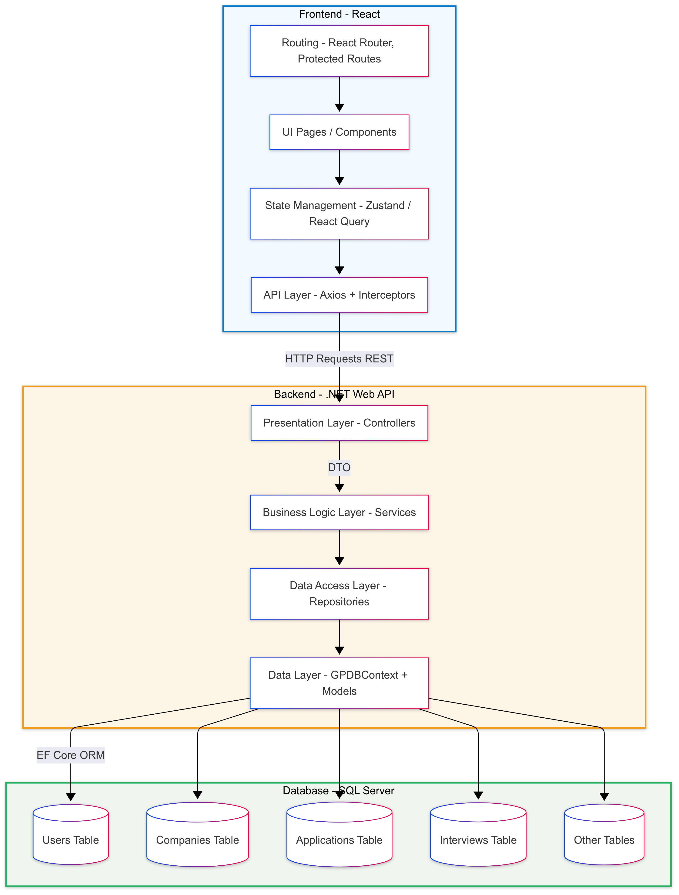

# AI-Driven Job Tracking Application

An intelligent platform designed to help job seekers manage their job applications and prepare for interviews. Our system automatically generates interview questions based on job descriptions and resumes using AI, enabling users to simulate realistic technical interviews and improve their readiness.

## Overview

The **AI-Driven Job Tracking Application** is a full-stack graduation project built to simplify and automate the interview preparation process. Users can:
- Track their job applications with metadata like status, company, and submission date.
- Automatically generate personalized interview questions based on the job description.
- Record and store interview sessions.
- Manage performance data and revisit previous interviews.

This project aims to bridge the gap between job listings and candidate readiness by using AI to simulate real interview experiences.

---

## Technologies Used

### Backend
- **.NET Core (C#)** – Primary backend framework (Web API)
- **FastAPI (Python)** – AI service for question generation
- **Microsoft SQL Server** – Relational database for core entities

### Other Tools
- **AutoMapper** – DTO mapping
- **Entity Framework Core** – ORM for data access
- **Swagger** – API documentation
- **Docker** – For containerized deployment of services

---

## Architecture

The application follows a **Modular Layered Architecture**:




            +---------------------------+
            |   FastAPI Microservice    |
            | - Question Generation AI  |
            +---------------------------+

- **Low Coupling**: DTOs are used to decouple service layers from domain models.
- **Maintainability**: Separation of concerns is enforced through clean layering.
- **Interoperability**: AI features are isolated as a FastAPI service to allow language independence.

---

## How to Run

### Prerequisites
- [.NET 8 SDK](https://dotnet.microsoft.com/en-us/download)
- [SQL Server](https://www.microsoft.com/en-us/sql-server/sql-server-downloads)
- (Optional) Docker for containerized setup

---

### 1. Clone the Repository
```bash
git clone https://github.com/Ahmed-waled/ai-job-tracking-app.git
cd ai-job-tracking-app
````

---

### 2. Set Up the .NET Backend

```bash
cd app
dotnet restore
dotnet ef database update     # Apply migrations
dotnet run
```

API will run at: `https://localhost:5001` (or as configured)

---

### 4. Test with Swagger

Visit `https://localhost:5001/swagger` to explore the API and test endpoints.

---

## Future Plans

* Frontend interface using React or Blazor
* Add user analytics and feedback
* Support real-time video/audio interview features

